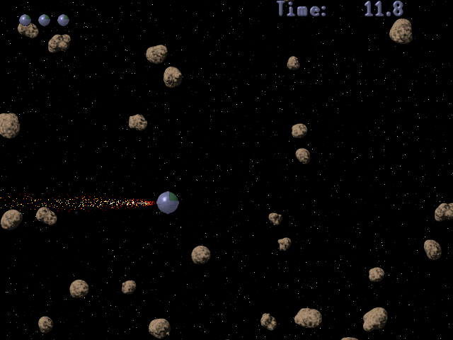
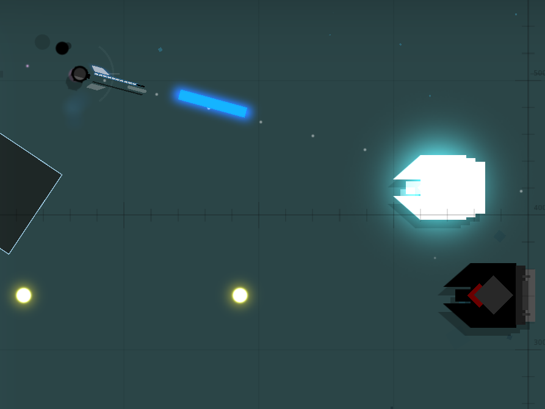
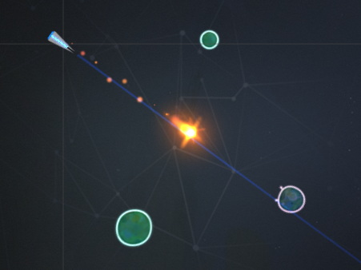
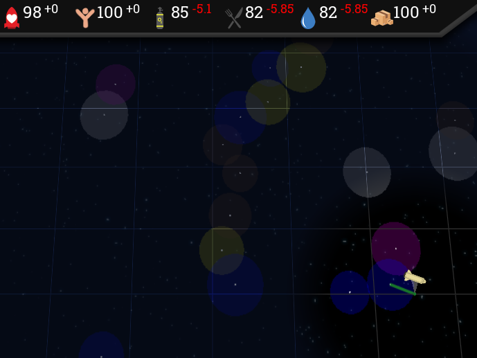
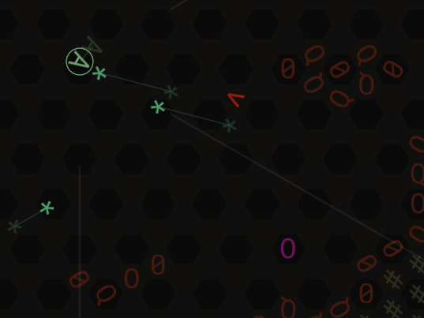

I'm demonstrating five games: one that I wrote solo, two that I
collaborated on, and two by my brother [Ross](http://rossgrams.com/).

* [Variations on Rockdodger](#variations-on-rockdodger)
* [Gunpods Vagabond](#gunpods-vagabond)
* [Asteroid Blaster](#asteroid-blaster)
* [Oxygen Trail](#oxygen-trail)
* [Yam of Endor](#yam-of-endor)

-----

## Variations on Rockdodger

[Variations on Rockdodger](http://sametwice.com/vor) is a game that my
cousin Jason Woofenden and I wrote in 2004-2006. It's a fork of [an
earlier game](http://spacerocks.sourceforge.net/) by Paul Holt.

Dodge the rocks until you die, surviving as long as possible. You have
thrusters in the four cardinal directions. The screen mostly scrolls
freely to keep up with your ship, though there is an invisible wall
which will catch up and push you if you go too slowly for too long.
Rocks bounce off each other, and your thrusters push the rocks (though
they're fairly heavy).

Beginner challenge: you may only tap the keys (no holding). You may only
use the up/down keys (no left/right). Play on easy mode (press '1') and
try to make it to 45 seconds on a single life.

## Gunpods Vagabond

[Gunpods Vagabond](https://rossgrams.itch.io/gunpods-vagabond) was
written by [Ross Grams](http://rossgrams.com/) in 2016 using the Godot
engine.

A side-scrolling shoot-em-up. Fly a helicopter-like spaceship, using
your ship's dash attack and seven different weapons to blast through
waves of blocks, rocks, and 15 different enemy types. Deal with the
giant explosions of proximity mines, fend off swarms of tiny tracking
drones, dodge flights of fast-moving fighters, and try not to destroy
yourself or your friends with the grenade launcher.

Supports local co-op with up to three players.

## Asteroid Blaster

[Asteroid Blaster](https://rossgrams.itch.io/asteroidblaster) was
written by [Ross Grams](http://rossgrams.com/) in 2017 using the Defold
engine.

This was his exercise in taking a very simple game and making a complete
polished version to gain experience in end-to-end game development.

It has nice audio, jelly asteroids which subtly change shape, and two
enemy types. The lightweight bumbling blob enemies mostly putter around
minding their own business, and then occasionally run into you when
you're not paying attention. Then there are the extremely dangerous
Hunters which chase you down and fire seeking missile blobs at you.

Your ammo slowly regenerates over time, or you get it back immediately
when you hit something, encouraging accuracy and penalizing misses.

Your bullets push the asteroids, so they can get going very fast if you
shoot them from behind. This adds another layer of tactics and makes the
blobs more dangerous, as they can move quite quickly when dodging
asteroids.

## Oxygen Trail

Oxygen Trail is an as-yet unreleased spare-time collaboration between
[Philippe Patenaude](https://ppatenaude.itch.io/), Michael Ackerson, and
Joshua Grams. It has written in the LÖVE 2D engine starting in late
October of 2017.

It's a lighthearted space adventure game inspired by Oregon Trail and
[Seedship](http://philome.la/johnayliff/seedship/play). Manage your
food, water, air, and other resources as you traverse a hazardous galaxy
to bring your shipload of colonists to their new home.

## Yam of Endor

[Yam of Endor](https://joshgrams.itch.io/asctiiroid) is a game that I
started for the [2018 Seven-Day Roguelike
Challenge](https://itch.io/jam/7drl-challenge-2018), spending about 20
hours building the initial version, and a further 70 or so hours
polishing and tuning it. It's written in the LÖVE 2D engine.

It's a turn-based roguelike space shooter where you explore five levels
of randomly generated caves to collect food, then return to the surface
to save your starving space colony.

This is an attempt to capture the feel of Asteroids games or cave flyers
but without the time pressure. So it still has that sense of momentum
and inevitability because it takes as long to stop as it did to get
going. And there's still the tension between wanting to aim in *this*
direction to shoot the enemies but in *that* direction to slow down
before you crash into a wall. But you can stop at any point and take as
long as you like to think about what to do next.
